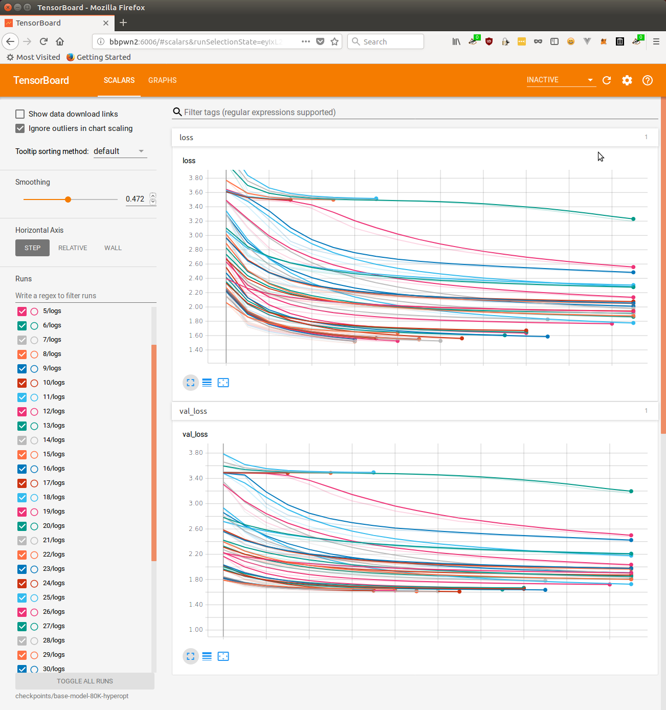
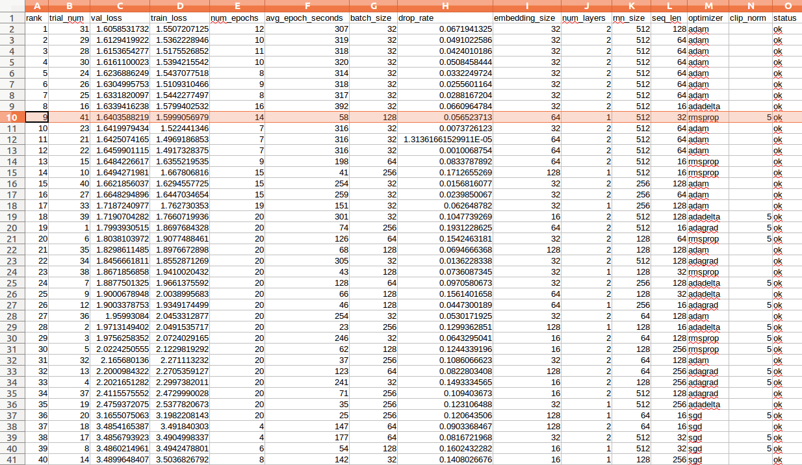

# Character Embeddings RNN Text Generation Model

Originally authored by [YuXuan Tay](https://github.com/yxtay) and inspired by [Andrej Karpathy](https://github.com/karpathy/)'s 
[The Unreasonable Effectiveness of Recurrent Neural Networks](https://karpathy.github.io/2015/05/21/rnn-effectiveness/).

We've made considerable changes to the [original repository](https://github.com/yxtay/char-rnn-text-generation), namely we've:

- Removed all implementations except the keras model
- Heavily restructured/rewritten the keras model to better fit our needs (added `train.py`, `generate.py`, etc.)
- Added support for hyperparameter search with `hyperparameter-search.py`.
- Added `utils.io_batch_generator()` that lazy-loads (and releases) data from disk into RAM, effectively allowing limitless training / validation data to be used. In the original implementation, training data was significantly limited by computer memory resources.
- Added `scripts/` and default parameters for twitter bot creation using the twitter_cikm_2010 dataset.
- Updated this README to reflect those changes.

## Twitter Bots

Although this model may be used for any text generation task, we've tuned it to generate tweets using a dataset of over 9,000,000 tweets from ~2009-2010. This README will briefly outline the usage of several tools in this repository like `train.py`, `generate.py` and `hyperparameter-search.py`. The purpose of this training task is to create a robust, resource-limited model in keras for generating tweets that can be later fine-tuned using transfer learning in Tensorflow.js with [`brangerbriz/twitter-transfer-learning`](https://github.com/brangerbriz/twitter-transfer-learning).

## Getting Started

```bash
# clone the repo
git clone https://github.com/char-rnn-text-generation
cd char-rnn-text-generation

# download Twitter CIKM 2010 twitter data, shuffle it, and separate it into:
# ├── data/tweets-split/
# │   ├── test.txt
# │   ├── train.txt
# │   └── validate.txt
./scripts/download-data.sh
```

Check to make sure that you now have three text files inside `data/tweets-split/`. If so, you can move on to install the python3 dependencies.

```bash
# install python3 dependencies with pip3
pip3 install -r requirements.txt

# or...

# use a virtual enviroment
virtualenv -p python3 venv # create the virtual env with python3
source venv/bin/activate # activate the virtual env
```

## Usage 

### Model Training

```
$ python3 train.py --help
Using TensorFlow backend.
usage: train.py [-h] --checkpoint-dir CHECKPOINT_DIR [--data-dir DATA_DIR]
                [--restore] [--num-layers NUM_LAYERS] [--rnn-size RNN_SIZE]
                [--embedding-size EMBEDDING_SIZE] [--batch-size BATCH_SIZE]
                [--seq-len SEQ_LEN] [--drop-rate DROP_RATE]
                [--learning-rate LEARNING_RATE] [--clip-norm CLIP_NORM]
                [--optimizer {sgd,rmsprop,adagrad,adadelta,adam}]
                [--num-epochs NUM_EPOCHS]

train an LSTM text generation model

optional arguments:
  -h, --help            show this help message and exit
  --checkpoint-dir CHECKPOINT_DIR
                        path to save or load model checkpoints (required)
  --data-dir DATA_DIR   path to a directory containing a train.txt and
                        validate.txt file (default: data/tweets-split)
  --restore             restore training from a checkpoint.hdf5 file in
                        --checkpoint-dir.
  --num-layers NUM_LAYERS
                        number of rnn layers (default: 1)
  --rnn-size RNN_SIZE   size of rnn cell (default: 512)
  --embedding-size EMBEDDING_SIZE
                        character embedding size (default: 64)
  --batch-size BATCH_SIZE
                        training batch size (default: 128)
  --seq-len SEQ_LEN     sequence length of inputs and outputs (default: 32)
  --drop-rate DROP_RATE
                        dropout rate for rnn layers (default: 0.05)
  --learning-rate LEARNING_RATE
                        learning rate (default: the default keras learning
                        rate for the chosen optimizer)
  --clip-norm CLIP_NORM
                        max norm to clip gradient (default: 5.0)
  --optimizer {sgd,rmsprop,adagrad,adadelta,adam}
                        optimizer name (default: rmsprop)
  --num-epochs NUM_EPOCHS
                        number of epochs for training (default: 10)
```

### Text Generation

```
$ python3 generate.py --help
usage: generate.py [-h] --checkpoint-path CHECKPOINT_PATH
                   (--text-path TEXT_PATH | --seed SEED) [--length LENGTH]
                   [--top-n TOP_N]

generate synthetic text from a pre-trained LSTM text generation model

optional arguments:
  -h, --help            show this help message and exit
  --checkpoint-path CHECKPOINT_PATH
                        path to load model checkpoints (required)
  --text-path TEXT_PATH
                        path of text file to generate seed
  --seed SEED           seed character sequence
  --length LENGTH       length of character sequence to generate (default:
                        1024)
  --top-n TOP_N         number of top choices to sample (default: 3)
```

### Hyperparameter Search

Finding the right hyperparameters for a model + dataset can be challenging and time consuming. For this reason we've added [`hyperpameter-search.py`](hyperparameter-search.py) which you can use to automate the hyperparameter selection process using [`hyperopt`](https://github.com/hyperopt/hyperopt). Unlike `train.py` and `generate.py`, `hyperparameter-search.py` does provide command-line arguments. Instead, you can edit a few constants in the file itself to setup a long-running hyperparameter search experiment.

```python
# the number of individual models to train using different hyperparameters
NUM_TRIALS = 20
# the maximum number of epochs per trial
MAX_EPOCHS_PER_TRIAL = 10
TRAIN_TEXT_PATH = 'data/tweets-split-tmp/train.txt'
VAL_TEXT_PATH = 'data/tweets-split-tmp/validate.txt'
# trials will be saved in this directory in separate folders specified by their
# trial number (e.g. 1/, 2/, 3/, 4/, etc.)
EXPERIMENT_PATH = 'checkpoints/20-trials-10-epochs'

# each trial will sample values from this search space to train a new model.
# see hyperopt's documentation if you would like to add different types of 
# sampling configurations.
SEARCH_SPACE = {
    'batch_size': hp.choice('batch_size', [16, 32, 64, 128, 256, 512]),
    'drop_rate': 0.0,
    'embedding_size': hp.choice('embedding_size', [16, 32, 64, 128, 256]),
    'num_layers': 1, # you can replace these constants with hp.choice() or hp.uniform(), etc.
    'rnn_size': 512,
    'seq_len': hp.choice('seq_len', [16, 32, 64, 128, 256]),
    'optimizer': hp.choice('optimizer', ['rmsprop',
                                         'adagrad',
                                         'adadelta',
                                         'adam']),
    'clip_norm': hp.choice('clip_norm', [0.0, 5.0])
}

# Use "Tree of Parzen Estimators" as the search algorithm by default. 
# You can switch to "Random Search" instead with:
#     SEARCH_ALGORITHM=rand.suggest
SEARCH_ALGORITHM=tpe.suggest
```

Once you've edited these constants to your liking, you can run an automated hyperparameter search like so:

```bash
python3 hyperparameter-search.py
```

The search can take anywhere from a few hours to several days depending on your search configuration and computer resources. As the trials are run `EXPERIMENT_PATH` will be populated by folders representing each trial, as well as a detailed `trials.csv` file which ranks the current hyperparameter search results.

```bash
checkpoints/checkpoints/20-trials-10-epochs/
├── 1 # each trial has its own folder
│   ├── checkpoint.hdf5 # with its own saved model checkpoint
│   └── logs # and it's own tensorboard log directory
├── 2
├── 3
|...
├── 18
├── 19
├── 20
├── trials.csv # a csv containing information about each trial
└── trials.pickle # this is a pickle of the list of trial objects. You can ignore it.
```

You can view the graphed loss and val_loss values for all trials using tensorboard.

```bash
$ tensorboard --logdir
TensorBoard 1.10.0 at http://localhost:6006 (Press CTRL+C to quit)
```



Here is another view of the same data found in `trails.csv`. It's worth noting here that we actually chose trial #41 as the optimal hyperparameters to use for our model in production. That may be surprising considering it ranks as only the 9th lowest validation loss out of all of the trials. Notice trial #41 has a significantly lower average training epoch time than any of the higher ranked trials, as it achieved a passable loss using only 1 layer of 512 RNN units instead of 2. For our use case, we will be [deploying our model in a web browser](https://github.com/brangerbriz/twitter-transfer-learning) and further training it on low-resources devices, so we are willing to trade a lower model accuracy in exchange for a dramatically faster model.


